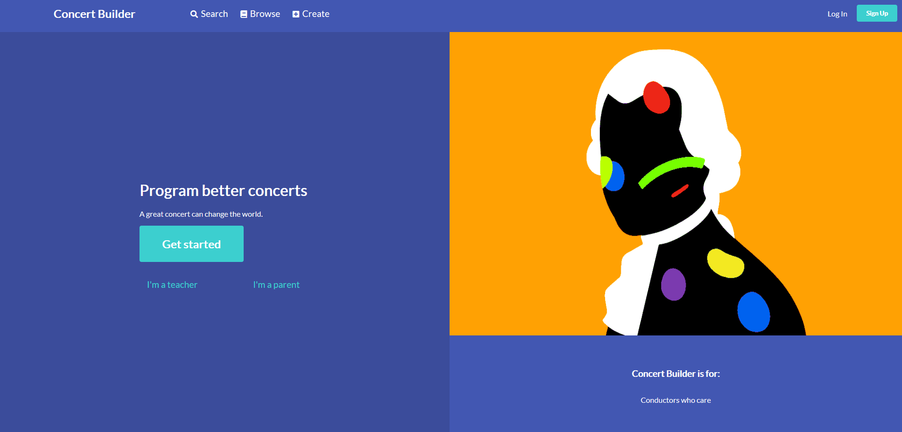

# Concert Builder

Concert Builder is a full-stack application built with Javascript, HTML, CSS, and a Flask backend. Users can create accounts and log in, view a large catalouge of orchestral works and their relevant information, save them to their favorites, leave comments that are viewable by other users, and can create their own concerts for later reference. 

[__Concert Builder__](www.concertbuilder.com) is  the most advanced and complex application I have made yet. It fits in directly to a skill that I practice in my other life as an orchestral conductor -- which is researching and assembling concert programs. As a conductor, you are a curator. You are responsible for picking music that the orchestra plays. You must take into account many factors, such as duration, instrumentation, diversity, community, and audience demographics. 

<!-- There is a great tool at [daniels-orchestral.com](www.daniels-orchestral.com) that assists with research and discovery. I wrote a web scraper tool to pull data from this site and put it in my own database. For this reason, the website cannot be public.  -->

<!-- However, there is no tool on their site to add pieces to a concert, move those pieces around, stack them up, see how long the concert is, and save the concert for your easy reference.  -->

In [__Concert Builder__](www.concertbuilder.com), you can look up your favorite composers, add a piece to your favorites list, and then build concerts combining your favorite pieces. It is then easy to consult your list of created concerts. 
